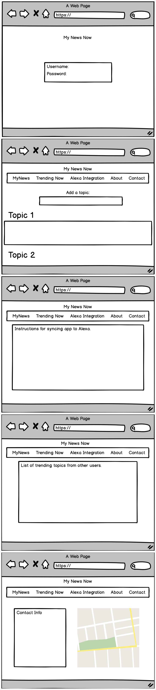

# Project 3 MyNewsNow 
​
 Kiran Kesari, Carlos Castrillon, Shirley Wang, Brigid Woolery
​
## Description
​
MyNewsNow is a custom web scraping app, which will eventually be integrated with Alexa as a skill. We believe this app has value in that it allows the user to carefully curate the topics that are important to them and to see various news articles from across the internet.
​
### How to interact
​
1. A webpage with a username/login. The user will provide topics for scraping. The scraped topic material will be stored in a database. These results will be displayed on the webpage in a formatted boxed style.
​
2. An Alexa skill will be created to interact with the app. User will be able to issue a voice command to prepare a custom newsfeed basic on one of their chosen topics.
​

Scratch of MyNewsNow
​

Sources have included 
​

New users can register with their email and password for future login.
​

Users can login with their name, email and password and they will have their personalized pages.
​

After user login, the website will have a welcome page with your name shown on the top
​

User is able to input the topics interested to them and they will be able to see the news sources, the article title and the link
​
## Technology Used
​
* Google Fonts
* Passportjs
* Bcrypt
* MERN Framework
* MongoDB
* React.js
* Express.js
* Cheerio
* React-Router
* Create React App
* Get and Post Routes 
* Heroku Deployment
* Axios
* html
* css
​
## Future addition
For a future advance, we would like to include two more features:
* Integrating Alexa skill
* Washington Post Integration